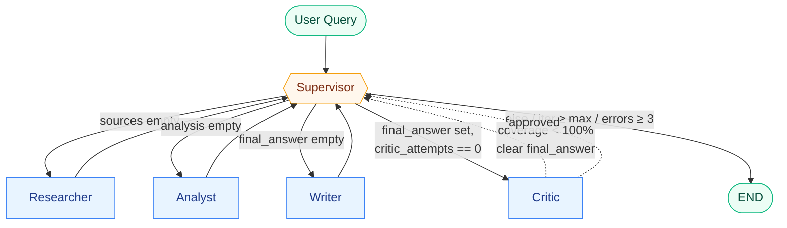

# Design — Multi-Agent Research System

## Problem

Trả lời câu hỏi nghiên cứu mở dạng "tìm hiểu X và viết tóm tắt 500 chữ", trong đó cần:
tìm nguồn, đối chiếu, trích xuất claim, viết câu trả lời có citation và source list.

## Why multi-agent?

Single-agent một lượt phải vừa đọc snippets, vừa phân tích, vừa viết — temperature và prompt
budget bị chia sẻ giữa các mục tiêu mâu thuẫn (chính xác vs. mượt). Multi-agent tách thành 3
giai đoạn với prompt chuyên biệt và temperature riêng (0.2 / 0.1 / 0.4), dễ debug từng bước
qua trace, và mỗi agent có thể được retry/thay thế độc lập.

## Agent roles

| Agent | Responsibility | Input | Output | Failure mode |
|---|---|---|---|---|
| Supervisor | Routing deterministic + enforce guardrails | `ResearchState` | append vào `route_history` | Loop nếu policy sai → chặn bằng `max_iterations` |
| Researcher | Search + tóm tắt grounded notes có `[n]` | `request.query` | `state.sources`, `state.research_notes` | Search 0 kết quả → ghi note "no sources" rồi tiếp tục |
| Analyst | Trích key claims, đối chiếu, flag điểm yếu | `state.research_notes` | `state.analysis_notes` | Notes rỗng → raise `AgentExecutionError`, supervisor fallback |
| Writer | Synthesize markdown + Sources list (uses critic feedback nếu có) | research + analysis + sources + `critic_feedback` | `state.final_answer` | Citation thiếu lần 1 → critic gửi lại; lần 2 vẫn thiếu → chấp nhận, log |
| Critic (bonus) | Kiểm citation coverage, ép retry tối đa 1 lần | `state.final_answer`, `state.sources` | `state.critic_feedback`, có thể clear `final_answer` | Coverage giảm sau retry → bounded bằng `max_retries=1` |

## Shared state

Pydantic model trong [core/state.py](../src/multi_agent_research_lab/core/state.py):

- `request: ResearchQuery` — input bất biến.
- `iteration`, `route_history` — supervisor dùng để dừng / debug.
- `sources`, `research_notes`, `analysis_notes`, `final_answer` — slot output của từng agent.
- `agent_results` — log có structured metadata (tokens, cost) → benchmark đọc trực tiếp.
- `trace` — span events cho observability.
- `errors` — supervisor đọc để chuyển sang fallback path.

## Routing policy

Deterministic, ưu tiên rõ ràng hơn LLM-as-router cho lab này (rẻ, dễ test):

Diễn giải:

- **Supervisor** không gọi LLM — pure rule-based để cost tracking + test dễ.
- **Critic** chạy đúng 1 lần sau Writer; nếu citation coverage < 100%,
  clear `final_answer` rồi loop về Writer (kèm feedback). Sau lần retry, Supervisor
  bypass critic và đi `done` để tránh vô hạn.
- **Errors ≥ 3** → Supervisor cố vớt vát bằng Writer (salvage path), không retry mãi.
- **Iteration ≥ max_iterations** (default 6) → cứng dừng dù state chưa đủ.

## Guardrails

- **Max iterations**: `Settings.max_iterations` (default 6) — chặn loop.
- **Timeout**: per-LLM-call timeout = `Settings.timeout_seconds`.
- **Retry**: `tenacity` 3 attempts, exponential backoff (1-8s) cho cả LLM và search.
- **Fallback**: `_safe_run` trong workflow bắt `AgentExecutionError`, ghi vào `state.errors`,
  để supervisor route lại; nếu errors ≥ 3 → writer cứu vớt với notes hiện có.
- **Validation**: Pydantic schemas cho input/output; benchmark check `citation_coverage`
  để bắt hallucinated citations.

## Benchmark plan

3 queries trong [configs/lab_default.yaml](../configs/lab_default.yaml). Metric:

| Metric | Cách đo | Expected |
|---|---|---|
| Latency | wall-clock | multi-agent **chậm hơn** (≥2× số LLM call) |
| Cost (USD) | sum tokens × giá model | multi-agent **đắt hơn** (~2×) |
| Citation coverage | unique `[n]` trong final / số nguồn | cả hai ≥ 80% |
| Failure rate | exception bắt được | 0% trên 3 queries |

Kết quả thực tế: xem [reports/benchmark_report.md](../reports/benchmark_report.md).

## Failure modes đã gặp & cách fix

1. **LangGraph state merging với BaseModel** — nodes trả về full state có thể overwrite
   các field append (trace, agent_results) nếu một node nhánh không thấy update của node
   khác. *Fix*: graph hiện tại tuần tự (supervisor ↔ worker), mỗi node nhận state mới nhất
   nên không có race; nếu mở rộng song song cần dùng reducer.
2. **Tavily đôi khi trả snippet rỗng** — researcher prompt vẫn dùng index `[n]` nên
   không crash, nhưng research_notes có thể nói "insufficient evidence". *Fix*: tăng
   `max_sources` hoặc đổi `search_depth="advanced"`.
3. **Citation drift** — ở benchmark đầu (chưa có critic) writer bỏ sót 1 nguồn,
   q1 chỉ đạt 80% coverage. *Fix đã apply*: bonus CriticAgent compute coverage trên
   `final_answer`, nếu < 100% thì clear answer + gửi feedback liệt kê index thiếu để
   writer rewrite; bounded `max_retries=1` để không vô hạn. Sau khi enable, cả 3 query
   đạt 100% coverage (xem benchmark mới nhất).
4. **LangSmith 401 Unauthorized** — sai/expired API key làm trace không lên server
   nhưng không crash run (LangSmith client log warning rồi swallow). *Fix*: refresh
   key ở https://smith.langchain.com/settings; verify bằng `LANGSMITH_TRACING=true`
   + chạy 1 query, nếu không thấy warning trong stderr là OK.

## Exit ticket

1. **Khi nào nên multi-agent?** Task có **giai đoạn rõ ràng** (research → analyze → write),
   cần audit từng bước, cần khác temperature/prompt cho từng giai đoạn, hoặc cần **chuyên
   môn hoá** (vd: code-gen + test-gen + review). Trade-off ~2× latency/cost được bù bằng
   debuggability + chất lượng ổn định.
2. **Khi nào KHÔNG nên?** Task ngắn, deterministic, một bước (FAQ, classification,
   format conversion). Single-agent rẻ hơn, ít moving parts, cost thấp hơn — như benchmark
   cho thấy baseline đã đạt 100% citation coverage trên cả 3 query.
